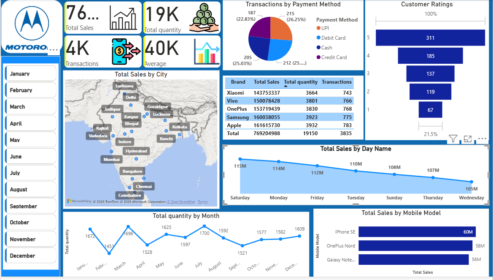

# Mobile Sales Analysis Dashboard (Power BI)

This project is a Power BI dashboard created to analyze mobile sales data.

## Key Insights
- Total sales, quantity & transactions
- Brand-wise and model-wise performance
- City-wise sales analysis
- Payment methods comparison
- Customer ratings
- Day-wise & month-wise trends

## Tools Used
- Microsoft Power BI
- DAX
- Data Visualization

## Dashboard Preview

## Acknowledgement
Learned Power BI from Satish Dhawale (Founder)

## Author
shalini swami

